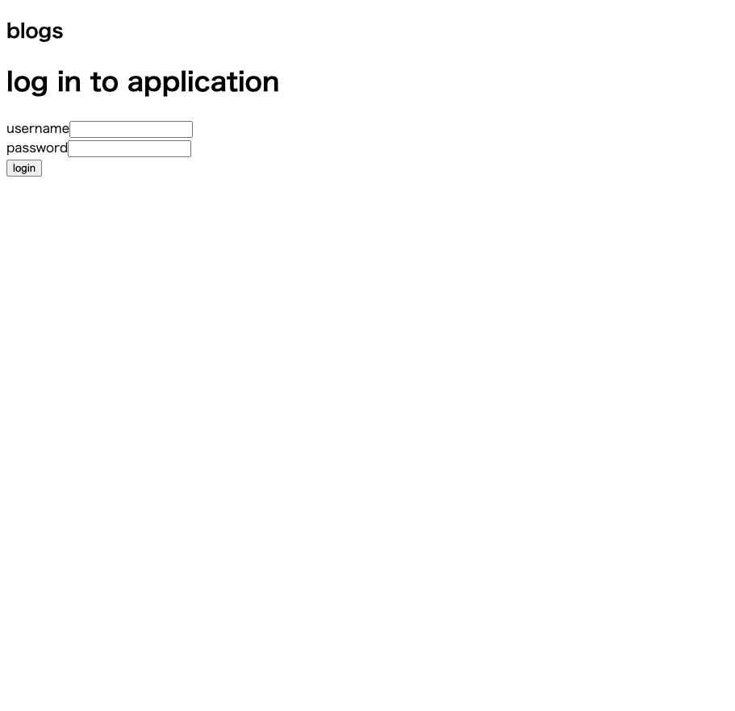
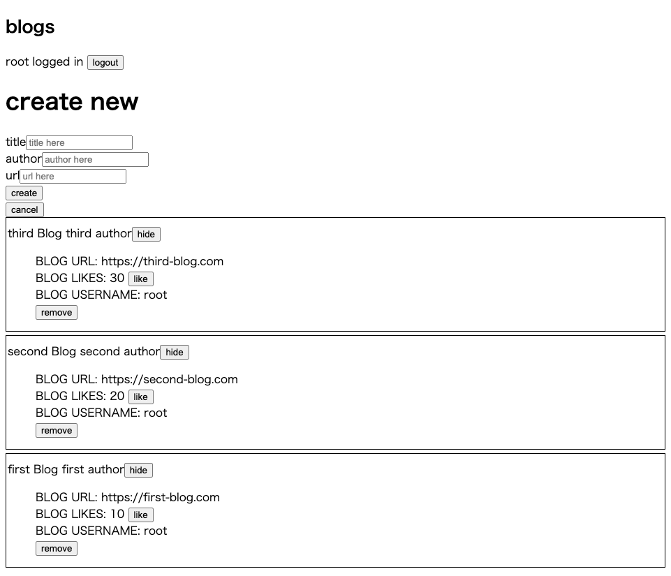

# About this repository

This is the repository for Full Stack open 2022. 
(URL:https://fullstackopen.com/en/)

I want to learn more recently FullStack technology, and I deceided to take the course.

This repository is for from Part4 to Part5 (client side).

Part4 is Testing Express servers, user administration : (URL:https://fullstackopen.com/en/part4)  
Part5 is Testing React apps : (URL:https://fullstackopen.com/en/part5)  

Through the above courses, student had to created simple bloglist application.
And, I finished the task. 

## ScreenShots of the project
This course is not for CSS. So, the site is not fancy...

## .env file

MONGODB_URI= "your mongodb uri here"  
PORT= "your localhost port number here"

Through the courses, I got the more knowledge of the latest web developer's world.
Fundamentals is always most important thing in the programming world.
So, I am satisfied with this course.

Thank you for reading.
And, happy coding!!!
